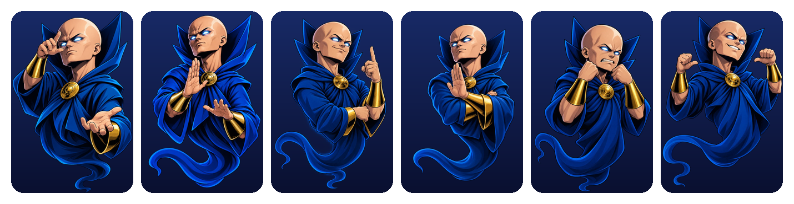
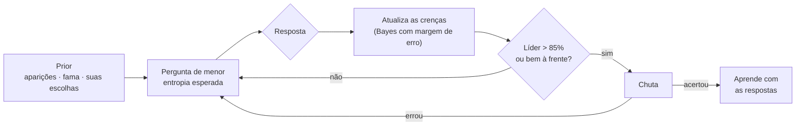
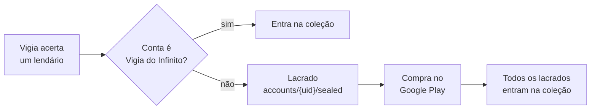
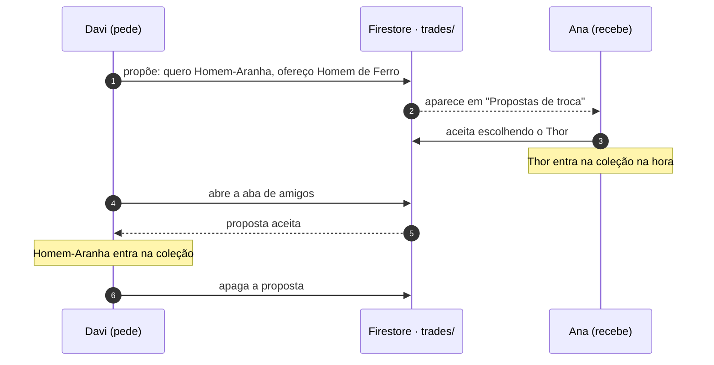
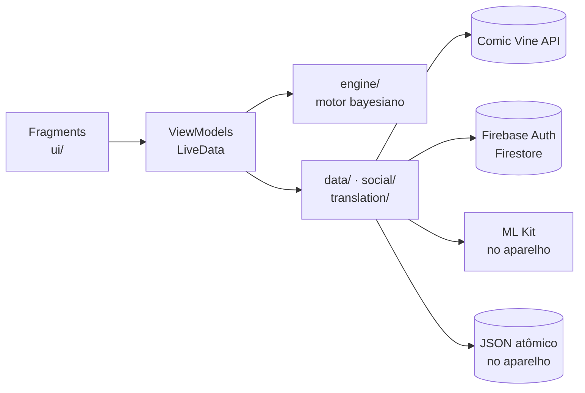

<div align="center">


# O Vigia

**Pense em um personagem da Marvel. O Vigia adivinha.**

Um jogo no estilo Akinator para Android, com um motor bayesiano que aprende a cada partida,<br/>
um catálogo de heróis para colecionar e amigos para trocar figurinhas.

[](https://github.com/dvarakaki/o-vigia-android/actions/workflows/android.yml)
[](https://github.com/dvarakaki/o-vigia-android/releases/latest)
[](LICENSE)


[**Baixar o APK**](https://github.com/dvarakaki/o-vigia-android/releases/latest) ·
[Como o Vigia pensa](#como-o-vigia-pensa) ·
[Rodar localmente](#começando) ·
[Arquitetura](#arquitetura)

<br/>



<sub>Pensando → focado → confiante → cético → irritado → triunfante: o Vigia reage à própria confiança a cada resposta.</sub>

</div>

---

## Sumário

- [Destaques](#destaques)
- [Como o Vigia pensa](#como-o-vigia-pensa)
- [Começando](#começando)
- [Raridade e Vigia do Infinito](#raridade-e-vigia-do-infinito)
- [Amigos online](#amigos-online)
- [Arquitetura](#arquitetura)
- [Qualidade](#qualidade)
- [Idiomas](#idiomas)
- [Dados curados](#dados-curados)
- [Publicação](#publicação)
- [Licença e créditos](#licença-e-créditos)

## Destaques

| | |
|---|---|
| **Adivinhação de verdade** | Motor bayesiano em Java puro: escolhe a pergunta que mais reduz a incerteza, tolera respostas erradas e só chuta quando tem convicção. |
| **Aprende com você** | Cada partida corrige as crenças do personagem jogado, inclusive em traços que a curadoria esqueceu. O aprendizado é por conta. |
| **Catálogo para colecionar** | 267 personagens curados, em quatro raridades. O herói só entra na coleção quando o Vigia acerta — com animação de revelação no catálogo. |
| **Vigia do Infinito** | Os lendários — os personagens que quase ninguém lembra — são exclusivos de quem compra o Vigia do Infinito (R$ 5,00, pagamento único pelo Google Play). |
| **Conquistas** | Equipes, vilões, partidas e vitórias, com cartão comemorativo por raridade (comum, rara, lendária) por cima de qualquer tela. |
| **Amigos e perfis** | `@usuario` único, pedidos de amizade, perfil com banner, bio, números, heróis e conquistas — visível só para amigos. |
| **Troca de heróis** | Troca 1 por 1 entre amigos, com sugestão do herói que fecha a sua próxima conquista. Ninguém perde o seu. |
| **Ficha completa do herói** | Dados da Comic Vine traduzidos: glossário curado à mão para poderes e origens, ML Kit no aparelho para o texto livre. |
| **Feito para durar** | Sobrevive à morte do processo, grava em disco de forma atômica, funciona offline com cache e roda R8 no release. |

## Como o Vigia pensa



1. **Prior.** Cada personagem começa com probabilidade proporcional a
   `log(2 + aparições em quadrinhos)`. Personagens mainstream ganham ×4, e os que você
   já escolheu ganham um bônus logarítmico.
2. **Modelo de resposta.** São cinco respostas — sim, provavelmente sim, não sei,
   provavelmente não, não — e cada uma tem uma probabilidade de ser dada por quem tem o
   traço e por quem não tem (ex.: "Sim" 80% contra 3%). A verossimilhança é a mistura
   ponderada pela crença do personagem no traço: um erro do jogador enfraquece um
   candidato, mas nunca o elimina.
3. **Escolha da pergunta.** O Vigia escolhe a pergunta que minimiza a entropia esperada,
   somando os desfechos possíveis, e sorteia entre as melhores para variar as partidas.
   Quando um líder se destaca, passa a escolher a pergunta que melhor separa esse líder
   dos demais.
4. **Hora de chutar.** Só depois de 8 perguntas (contadas de novo após cada chute errado),
   e apenas se o líder passar de 85% ou estiver bem à frente do 2º e do 3º colocados.
5. **Aprendizado.** Ao fim de cada partida com o personagem conhecido (acerto, escolha
   entre alternativas ou revelação após derrota), as respostas dadas corrigem as crenças
   daquele personagem.

## Começando

**Requisitos:** Android Studio (JDK 17+ embutido) e Android SDK 36. O app roda a partir do Android 9 (API 28).

1. Crie uma chave gratuita da API em <https://comicvine.gamespot.com/api/>.
2. Adicione a chave ao `local.properties` na raiz do projeto (fora do git):

   ```properties
   COMIC_VINE_API_KEY=sua_chave_aqui
   ```

3. Rode pelo Android Studio ou pela linha de comando:

   ```bash
   ./gradlew installDebug
   ```

O build de debug usa o id `com.ovigia.app.debug` e pode ficar instalado ao lado do de release.
Sem a chave, o jogo funciona apenas com o que já estiver em cache.

## Raridade e Vigia do Infinito

Quanto menos conhecido o personagem, mais raro ele é. A raridade fica no `roster.json` e
aparece no chute do Vigia, no resultado e no catálogo (gema no canto da carta e placar por
raridade no topo).

| Raridade | Regra de partida da curadoria | No elenco |
|---|---|---|
| Comum | conhecido do grande público com 1.500+ aparições, ou 4.000+ aparições | 48 |
| Raro | os demais conhecidos do grande público, ou 1.500+ aparições | 100 |
| Épico | 600+ aparições nos quadrinhos | 53 |
| **Lendário** | o resto — os que quase ninguém lembra | 66 |

As aparições vêm da Comic Vine; alguns ajustes à mão cobrem quem o cinema tornou mais
conhecido do que os números dizem (Phil Coulson, Abominável, Mandarim, Chicote Negro).

**Lendários são do Vigia do Infinito.** Qualquer um pode pensar num lendário e o Vigia
adivinha normalmente. Quando ele acerta e a conta ainda não é Vigia do Infinito, o resultado
mostra *"Você tentou desbloquear um personagem Lendário!"* e oferece a compra: o personagem
fica **lacrado** — aparece no catálogo com o nome, sem imagem e sem ficha — até a conta virar.
Comprou, todos os lacrados entram na coleção de uma vez, com a revelação animada.



- **Compra única** (`vigia_do_infinito`), feita pelo Google Play Billing. Ela fica presa à
  conta do O Vigia que comprou (vai junto um hash do id da conta, nunca o id), volta sozinha ao
  reinstalar e vale em qualquer aparelho com o mesmo Google Play. Outra conta do O Vigia no
  mesmo Google Play não herda a compra.
- **Pagamento pendente** (boleto, por exemplo) é tratado: a conta vira Vigia do Infinito
  quando o Google Play confirmar, mesmo com o app aberto. Toda compra paga é confirmada
  (*acknowledge*) — sem isso o Google estorna em 3 dias.
- **Lendários não entram em trocas** entre amigos. Quem já tinha um lendário de versões
  anteriores continua com ele.
- **Sem servidor próprio**, a conferência da compra acontece no aparelho, com a resposta da
  loja (como o resto do projeto, cabe no plano gratuito do Firebase). Para uma publicação em
  escala, valide o `purchaseToken` num servidor seu com a Google Play Developer API (e escute
  os estornos), do mesmo jeito que a chave da Comic Vine pede um proxy.

<details>
<summary><b>Configurar a venda no Play Console</b></summary>

<br/>

1. Publique o app numa faixa de teste (interna basta) — a compra só funciona com o app
   instalado pelo Google Play, com a mesma assinatura. O APK do GitHub mostra a compra como
   indisponível.
2. Em **Monetizar → Produtos → Produtos no app**, crie o produto `vigia_do_infinito`
   (compra única, não consumível) por **R$ 5,00** e ative-o.
3. Em **Configurações → Teste de licença**, adicione as contas de teste para comprar sem
   cobrança real.

Para ver o fluxo inteiro antes disso, o build de debug tem uma loja de mentira:

```properties
FAKE_BILLING=true
```

no `local.properties`. Ela não cobra nada, não sai do processo e nunca entra no release.

</details>

## Amigos online

A aba de amigos — pedidos de amizade, perfis, conquistas e troca de heróis — usa
**Firebase Auth + Cloud Firestore**. Sem configuração o app compila e roda normalmente, e a
aba avisa que os amigos não estão disponíveis. Tudo cabe no plano gratuito (Spark): foto e
banner vão reduzidos dentro dos documentos, sem Cloud Storage nem Cloud Functions.

<details>
<summary><b>Configurar o Firebase</b></summary>

<br/>

1. Crie um projeto no [console do Firebase](https://console.firebase.google.com/).
2. Adicione um app Android com o pacote `com.ovigia.app` e outro com `com.ovigia.app.debug`
   (o mesmo `google-services.json` serve para os dois).
3. Em **Authentication → Método de login**, ative **E-mail/senha**.
4. Em **Firestore Database**, crie o banco e publique as regras de [`firestore.rules`](firestore.rules)
   (cole na aba **Regras** ou rode `firebase deploy --only firestore:rules`).
5. Baixe o `google-services.json` para `app/` (fora do git) e rode o app de novo.

Para desenvolver sem projeto real, use o Firebase Local Emulator Suite:

```bash
firebase emulators:start --only auth,firestore --project demo-ovigia
```

e aponte o build de debug para ele no `local.properties` (`10.0.2.2` é o computador visto
pelo emulador Android):

```properties
FIREBASE_EMULATOR_HOST=10.0.2.2
```

</details>

> [!IMPORTANT]
> Sempre que o `firestore.rules` mudar numa versão nova (a 1.3.0 acrescentou a coleção
> `trades`), publique as regras de novo. Sem isso, o recurso novo falha no servidor — o
> resto da aba continua funcionando.

### Como funciona

- **A conta online usa o mesmo e-mail e senha da local.** Entrar ou criar a conta já abre a
  sessão online, então a aba de amigos não pede a senha de novo — só falta escolher um
  `@usuario` único. Sem internet no login, a senha fica cifrada com uma chave do Android
  Keystore, fora do backup (`social/KeystoreCredentialVault`), e o app termina a conexão
  sozinho depois; conectou, o arquivo é apagado e a sessão do Firebase assume.
- **Só amigos veem o perfil completo.** Nome, `@usuario` e foto aparecem na busca; bio,
  banner, números, heróis e conquistas só para amigos. O e-mail nunca é publicado.
- **Amizade só com pedido aceito.** As regras do Firestore garantem que só quem recebeu o
  pedido cria a amizade, e qualquer um dos dois pode desfazê-la.
- **A conta acompanha o jogador.** Entrar num aparelho novo recria a conta local com o que o
  servidor guardava: nome, bio, `@usuario`, foto, banner, heróis e números das partidas. O
  aprendizado do motor e o histórico partida a partida ficam no aparelho onde foram jogados.
- **Excluir a conta apaga também a online.** Sem internet, a exclusão espera a conexão para
  não deixar dados para trás.

### Troca de heróis

No perfil de um amigo, o app mostra o que dá para trocar e sugere o herói que mais vale
pedir — o que fecha ou adianta uma conquista de equipe ou de vilões, depois os mais
famosos — já com a melhor oferta escolhida (`social/TradeSuggestions`). Quem recebe vê a
proposta no topo da aba de amigos e pode aceitar o herói oferecido ou escolher outro no
catálogo de quem pediu. **Ninguém perde nada:** cada um ganha o herói do outro e continua
com o seu.



As regras garantem que só amigos trocam e que só quem recebeu aceita, uma vez. A posse dos
heróis não é conferida no servidor, porque a coleção vive no aparelho. Não há notificação
push (exigiria Cloud Functions): quem pediu recebe o herói ao abrir a aba de amigos.

## Arquitetura



```
app/src/main/
├── assets/roster.json        Elenco curado: times, poderes, vilania, reconhecimento
├── java/com/ovigia/app/
│   ├── MainActivity           Activity única (Navigation + fragments)
│   ├── AppContainer           Injeção de dependências manual
│   ├── engine/                Motor bayesiano — Java puro, sem Android
│   ├── game/                  GameViewModel, estado de UI, eventos e humor do Vigia
│   ├── data/                  Repositório (Comic Vine + cache), mapeamento, perguntas
│   ├── learning/              Aprendizado persistente entre partidas
│   ├── auth/                  Contas locais (PBKDF2), regras de senha e ViewModel de login
│   ├── collection/            Heróis desbloqueados, por conta
│   ├── catalog/               Catálogo e ficha do herói (regra de desbloqueio, ViewModels)
│   ├── profile/               Perfil e edição do perfil (foto, banner, dados, senha)
│   ├── social/                Firebase, @usuario, pedidos, conquistas, trocas e ViewModels
│   ├── settings/              Idioma, preferências da partida, vibração e cache
│   ├── translation/           Tradução dos textos da Comic Vine
│   └── ui/                    Fragments de cada tela
│       └── achievements/      Emblemas, lista do perfil e cartão da comemoração
├── res/values*/strings.xml    Português (base), inglês, espanhol e francês
├── res/values*/glossary.xml   Poderes e origens da Comic Vine nos mesmos idiomas
└── res/navigation/nav_main.xml   Fluxo de telas
```

- **MVVM com Activity única.** O `GameViewModel` vive no escopo do grafo `game_graph`: nasce
  ao entrar na partida e é destruído ao sair dela.
- **Sobrevive à morte do processo.** Cada jogada vai para um log no `SavedStateHandle`; ao
  restaurar, o log é reaplicado no motor e a mesma pergunta volta à tela.
- **I/O fora da main thread.** Disco e rede rodam num executor de I/O; as gravações são
  atômicas (arquivo temporário + rename). O StrictMode fica ligado no debug.
- **Rede dos amigos em thread própria.** O Firebase roda num executor separado, para uma
  conexão lenta não segurar as gravações em disco. O `SocialBackend` é uma interface: os
  testes usam um servidor em memória com as mesmas garantias do `firestore.rules`.
- **Conquista comemorada uma vez só.** As conquistas são recalculadas do zero a cada consulta;
  quem separa "acabou de cair" de "já era sua" é o `social/AchievementsStore`. A primeira
  consulta de cada conta é um marco zero silencioso, para não despejar cartões em quem
  atualizou o app com meia coleção pronta.

### Stack

| Camada | Tecnologia |
|---|---|
| Linguagem | Java 17 · Android SDK 36 (min 28) |
| UI | Views + ViewBinding · Material 3 · Navigation · SplashScreen |
| Arquitetura | MVVM · ViewModel + SavedState · LiveData · DI manual |
| Rede | Retrofit · OkHttp · Gson · jsoup |
| Imagens | Glide |
| Online | Firebase Auth · Cloud Firestore (plano Spark) |
| Tradução | ML Kit Translate (no aparelho) + glossário curado |
| Build | Gradle (Kotlin DSL) · version catalog · R8 · GitHub Actions |

## Qualidade

| Comando | O que faz |
|---|---|
| `./gradlew testDebugUnitTest` | Testes JVM: motor, ViewModels, aprendizado, amigos, trocas, conquistas, dados curados, tradução e regras do R8 |
| `./gradlew connectedDebugAndroidTest` | Testes que precisam de aparelho (o tradutor do ML Kit) |
| `./gradlew lintDebug` | Lint (quebra o build em erro) |
| `./gradlew assembleRelease` | APK de release com R8 (encolhido e ofuscado) |

O CI ([`.github/workflows/android.yml`](.github/workflows/android.yml)) roda testes, lint e o
build de release a cada push na `main`, em tags e em pull requests.

> [!NOTE]
> Tudo que o Gson lê ou grava em JSON precisa de regra em `app/src/main/keepRules/rules.keep`:
> sem ela o R8 renomeia os campos e apaga o tipo genérico, e os dados voltam do disco com o
> tipo errado só depois de reabrir o app — algo que os testes JVM não enxergam. O
> `KeepRulesTest` confere isso; ao criar um arquivo JSON novo, acrescente a classe raiz à lista dele.

## Idiomas

O app é traduzido para **português** (base, `values/`), **inglês**, **espanhol** e **francês**.
O jogador escolhe o idioma em **Configurações** (ou, no Android 13+, nas configurações do
sistema para o app); "Automático" segue o idioma do aparelho. A escolha usa o idioma por app
do AppCompat, então a tela é recriada já traduzida — inclusive as perguntas da próxima partida.

<details>
<summary><b>Adicionar um idioma</b></summary>

<br/>

1. Crie `res/values-<idioma>/strings.xml` com todos os textos traduzíveis (o lint quebra o
   build se faltar algum), inclusive `content_language` com o código do idioma.
2. Traduza `res/values-<idioma>/glossary.xml` (poderes e origens da Comic Vine).
3. Adicione o idioma em `settings/AppLanguage`, em `res/xml/locales_config.xml` e o nome
   dele em `strings.xml` (`language_*`, escrito no próprio idioma).

O `AppLanguageTest` e o `ComicVineGlossaryTest` conferem se os lugares estão de acordo. A
marca "O Vigia" não é traduzida; nas frases, o personagem usa o nome oficial em cada idioma
(the Watcher, el Vigilante, le Gardien).

</details>

### Os textos da Comic Vine

A API só existe em inglês, e a ficha do herói é quase toda feita dela. A tradução acontece
em duas frentes, ambas sem custo e sem chave:

- **Vocabulário fechado** (128 poderes, 10 origens e as galerias de imagem): traduzido à mão
  em `res/values*/glossary.xml` e ligado aos ids da API em `translation/ComicVineGlossary`.
  Aparece na hora e sem os erros que um tradutor automático cometeria sem contexto.
- **Texto livre** (resumo, biografia, nascimento em texto): traduzido pelo **ML Kit dentro do
  aparelho**. O pacote de cada idioma tem cerca de 30 MB, é baixado uma vez (em rede móvel,
  só com o aval do jogador) e depois funciona offline.

A biografia de um herói famoso passa de 200 mil caracteres. Por isso ela é recortada em
trechos (`translation/HtmlTextRuns`, que preserva imagens, tabelas e links), traduzida trecho
a trecho e guardada em disco: o jogador vê o andamento, sair da tela cancela o trabalho e
voltar continua de onde parou. A barra no topo da ficha oferece "Ver original" a qualquer momento.

> [!NOTE]
> O tradutor do ML Kit é uma biblioteca nativa: ela soma cerca de 15 MB por ABI ao download
> do app na loja (o AAB entrega só a ABI do aparelho).

## Dados curados

`assets/roster.json` define o elenco. Para adicionar um personagem:

```json
{"id": 1440, "name": "Wolverine", "teams": ["xmen"], "powers": ["forca", "cura", "armas", "sentidos"], "villain": 0.08, "mainstream": true, "rarity": "comum"}
```

| Campo | Significado |
|---|---|
| `id` | Id do personagem na Comic Vine |
| `teams`, `powers` | Precisam existir em `data/QuestionKeys` |
| `villain` | Crença entre 0 e 1 — use valores intermediários para anti-heróis |
| `mainstream` | Personagem conhecido do grande público (pesa no prior e nas sugestões de troca) |
| `rarity` | `comum`, `raro`, `epico` ou `lendario` — ver [Raridade](#raridade-e-vigia-do-infinito) |

O `RosterCatalogTest` valida o arquivo. Uma pergunta nova exige a chave em `QuestionKeys`,
o texto `q_<chave>` em cada `strings.xml` e a linha correspondente em `QuestionTexts`; o
`QuestionTextsTest` confere tudo.

## Publicação

### Versões e releases

A versão fica em `gradle.properties` (`ovigia.versionCode` / `ovigia.versionName`); incremente
o `versionCode` a cada publicação. Um push de tag `v*` faz o CI construir o APK de release e
publicá-lo numa [GitHub Release](https://github.com/dvarakaki/o-vigia-android/releases):

```bash
git tag v1.3.0
git push origin v1.3.0
```

### Assinatura

Crie um `keystore.properties` na raiz (fora do git):

```properties
storeFile=caminho/para/release.jks
storePassword=...
keyAlias=...
keyPassword=...
```

No CI, a keystore vem dos secrets `OVIGIA_KEYSTORE_BASE64`, `OVIGIA_STOREPASSWORD`,
`OVIGIA_KEYALIAS` e `OVIGIA_KEYPASSWORD`; o `google-services.json` e a chave da Comic Vine,
de `GOOGLE_SERVICES_JSON_BASE64` e `COMIC_VINE_API_KEY`. Sem eles, o build segue e o APK sai
sem assinatura, sem amigos ou só com cache.

### Chave da API em produção

Tudo que vai no `BuildConfig` pode ser extraído do APK. Para uma publicação séria, coloque um
proxy seu (Cloudflare Worker, Cloud Function etc.) na frente da Comic Vine que injete a chave
no servidor, e configure:

```properties
COMIC_VINE_BASE_URL=https://seu-proxy.exemplo.com/api/
COMIC_VINE_API_KEY=
```

Com a URL apontando para um proxy, o app funciona sem chave embutida.

## Licença e créditos

Código sob a [licença MIT](LICENSE).

Dados e imagens dos personagens vêm da [Comic Vine](https://comicvine.gamespot.com/api/).
Este é um projeto de fãs, sem fins lucrativos e **sem qualquer afiliação com a Marvel, a
Disney ou a Comic Vine**. Marvel, o Vigia (Uatu) e os demais personagens são marcas
registradas de seus respectivos donos.
